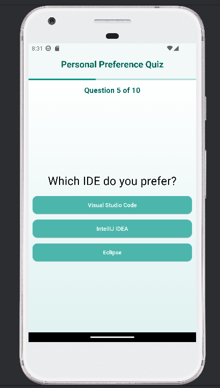
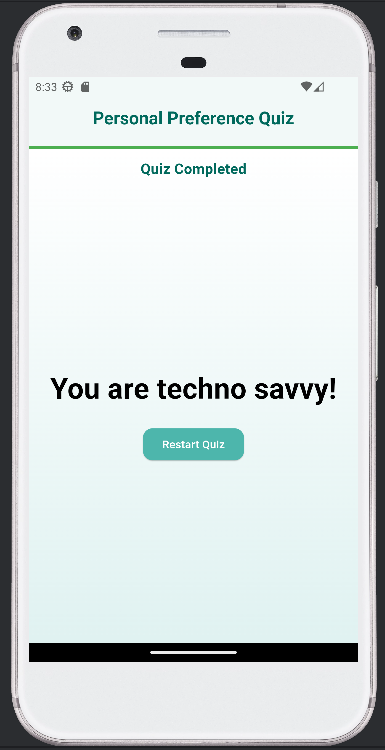

# Quiz app

A new Flutter project.

Overview
The Personal Preference Quiz App is a Flutter-based application designed to deliver an interactive quiz experience. 
The app dynamically adapts to the user's progress, providing a seamless and engaging experience.

Features:
1. Dynamic Progress Bar
   A linear progress bar at the top of the screen visually represents the user's progress through the quiz.
   Key Highlights:
   Dynamic Updates: The progress bar fills up as users answer questions.
   Completion Indicator: The color of the bar changes to green upon quiz completion, providing clear feedback.

2. Question Number Display
   Users are always aware of their position in the quiz through a dynamic question number display.
   Key Highlights:
   Updates in real-time with each question.
   Displays the current question number (e.g., "Question 2 of 7").
   At the end of the quiz, it changes to "Quiz Completed."

3. Clean and simple UI
   Key Highlights:
   Custom Theme: Teal and white-based theme with consistent styling for buttons, text, and backgrounds.
   Gradient Background: Provides a soft and appealing visual effect.

UI display

